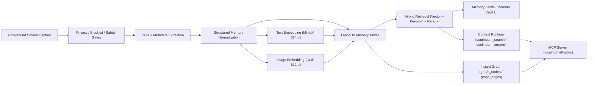

# Continuum

**A local-first multimodal memory engine for desktop context, semantic search, and agent-ready recall.**

Continuum is a macOS desktop system that continuously captures foreground context, extracts text and metadata, and stores compact memory records for retrieval. It is designed as an engineering-first memory layer, not a screenshot archive.

The core runtime is a React + TypeScript UI (`src/`) on top of a Tauri 2 + Rust backend (`src-tauri/`). The backend handles capture, OCR, normalization, embeddings, LanceDB persistence, hybrid retrieval, and MCP serving for external agents.

---

## 1. Project Overview

Continuum captures desktop activity and converts it into structured memory records. A memory record includes cleaned text, app/window/url metadata, retrieval fields, embeddings, and insight fields used to improve recall quality.

Search is hybrid by design: semantic vector retrieval and lexical retrieval run together, then get fused and reranked. This avoids the common failure mode where pure vector search loses exact identifiers and pure keyword search misses paraphrases.

Continuum also supports retrieval-grounded answering (`continuum_answer`) through a context runtime that plans retrieval routes, composes evidence, and returns cited answers. The same local memory can be exposed to external tools through an MCP server with explicit local/tunnel/public deployment modes.

Knowledge graph support exists in two forms: a legacy graph and an insight graph persisted in LanceDB (`graph_nodes`, `graph_edges`) for typed entities/relations and graph-aware recall workflows.

Privacy is a first-class system constraint: data stays local by default, capture can be paused, blocklists are enforced, and destructive deletion operations are implemented in source.

---

## 2. Why Continuum Exists

Personal context gets fragmented across browser tabs, terminals, editors, docs, chat windows, and meeting tools. Standard file search is mostly keyword-only and often fails when the user remembers intent but not exact wording.

LLM chats are session-scoped and do not reliably remember a user’s real desktop workflow history unless context is re-supplied. Cloud memory tools add privacy and control concerns because raw personal activity is uploaded to external services.

Continuum addresses this by building a local, inspectable memory layer:

- Capture context on-device.
- Convert it into structured, retrieval-ready records.
- Keep vector + lexical retrieval local.
- Expose memory to agents through controlled MCP interfaces.

---

## 3. Key Features

| Area | Implementation in this repo | Status |
| --- | --- | --- |
| Local-first capture pipeline | Rust capture loop with batching, dedupe, quality gates (`src-tauri/src/capture/`) | Stable |
| OCR and context extraction | Apple Vision OCR + structured memory synthesis | Stable |
| Metadata extraction | App name, window title, URL/domain, session/event fields in `MemoryRecord` | Stable |
| Memory cards / Memory Vault | UI surfaces under `src/domains/memory-vault/` | Stable |
| Semantic embeddings | Local ONNX embedder (`all-MiniLM-L6-v2`, 384-d) | Stable |
| Hybrid retrieval | Semantic + keyword fusion and reranking (`src-tauri/src/search/`) | Stable |
| Retrieval-grounded Q&A | `continuum_answer` / context runtime pipeline (`src-tauri/src/context_runtime/`) | Stable |
| Local vector store | LanceDB-backed memory + graph tables | Stable |
| Visual similarity retrieval | CLIP-based `image_embedding` + `find_visually_similar_memories` | Stable |
| Insight knowledge graph | Typed node/edge tables + graph UI hooks | Stable |
| MCP server for agents | `src-tauri/src/mcp/`, MCP deployment modes + auth/tls controls | Stable |
| Agent-oriented tools/prompts | `agent.*`, `memory.*`, prompt/resources in MCP | Stable |
| Manual photo import (Meta glasses flow) | `import_meta_glasses_photo` pipeline | Experimental |
| Some graph-RAG subgraph APIs | `continuum_get_memory_subgraph` currently returns bounded empty descriptor | Experimental |

---

## 4. Technical Architecture



### Core module map

| Module | Responsibility |
| --- | --- |
| `src-tauri/src/capture/` | Screen sampling, dedupe, quality gates, memory assembly |
| `src-tauri/src/ocr/` | OCR extraction and metadata |
| `src-tauri/src/embedding/` | Text and image embedding utilities |
| `src-tauri/src/storage/lance_store/` | LanceDB schema, normalization, persistence, retrieval IO |
| `src-tauri/src/search/` | Hybrid search, scoring, reranking, memory card shaping |
| `src-tauri/src/context_runtime/` | Retrieval planning, evidence composition, grounded answering |
| `src-tauri/src/graph/` | Insight graph entities/edges/store/pathing |
| `src-tauri/src/mcp/` | MCP transport, auth/origin controls, tool/resource/prompt handlers |
| `src/domains/*` | Search, Memory Vault, timeline, command palette, workspace UI |

### Data + retrieval notes

- Default text embedding contract in current code: `384` dimensions (`all-MiniLM-L6-v2`).
- Image embedding contract: `512` dimensions (CLIP column for visual similarity retrieval).
- Hybrid ranking combines semantic and lexical branches, then reranks with quality and relevance signals.
- Insight fields (for example `memory_context`, `insight_what_happened`, `insight_why_mattered`) are persisted and reused during retrieval/composition.

---

## 5. Installation and Run (macOS)

### Prerequisites

- macOS 13.0+ (from `src-tauri/tauri.conf.json`)
- Xcode Command Line Tools
- Node.js + npm
- Rust toolchain
- Python 3 (for bootstrap/sidecar helpers)
- `ffmpeg` (meeting capture path)

### Quickstart

```bash
npm install
./scripts/bootstrap/download-minilm.sh
npm run tauri dev
```

Optional: if you want the multimodal local model available for richer memory synthesis/import flows, download the Qwen3-VL assets into the same models directory.

### First run

Grant required macOS permissions during onboarding (screen capture/accessibility as prompted). Continuum stores app data under the Tauri app identifier path (`com.continuum.app`).

---

## 6. How to Use Continuum

1. Keep Continuum running while working normally across apps.
2. Use Search or Memory Vault to retrieve previous context.
3. Use Ask-style queries (`continuum_answer`) for grounded recall over stored memories.
4. Use workspace controls to pause/resume capture, manage blocklists, and inspect status.
5. Optionally start MCP for external agent access to local memory tools.

---

## 7. Privacy and Safety Controls

Implemented controls include:

- Pause/resume capture (`pause_capture`, `resume_capture`)
- App/site blocklist management (`get_blocklist`, `set_blocklist`, `add_to_blocklist`)
- Retention and deletion (`delete_older_than`, `delete_all_data`)
- Sensitive-context safety checks and private/incognito title heuristics (`src-tauri/src/privacy/`)
- MCP auth/origin policies for non-local deployment modes

Continuum is local-first by default. Optional environment variables can enable external integrations; review `.env.example` before enabling them.

---

## 8. MCP and Agent Integration

Continuum includes an MCP server with:

- Transport endpoints for streamable HTTP and legacy SSE compatibility
- Deployment modes: `local`, `tunnel`, `public`
- Optional TLS + bearer auth + allowed-origin controls
- Memory + agent tool surfaces (`memory.*`, `continuum.*`, `agent.*`)

Key environment variables:

- `CONTINUUM_MCP_MODE`
- `CONTINUUM_MCP_REQUIRE_AUTH`
- `CONTINUUM_MCP_ALLOW_LOOPBACK_AUTH_BYPASS`
- `CONTINUUM_MCP_ENABLE_TLS`
- `CONTINUUM_MCP_ALLOWED_ORIGINS`
- `CONTINUUM_MCP_PUBLIC_BASE_URL`

---

## 9. Configuration

Runtime configuration is persisted via `src-tauri/src/config.rs` and user config files (TOML). `.env.example` documents optional integration and deployment variables.

Notable defaults in current code:

- `retention_days = 7`
- `screenshot_retention_days = 30`
- `embedding.dimension = 384`
- `use_vlm = true`

---

## 10. Development and Verification

### Full default verification

```bash
make test
```

Runs:

- `npm run typecheck`
- `npm test`
- `cd src-tauri && cargo test`

### Useful maintenance commands

```bash
make diagnostic
make reset-lancedb
make clean-dev-cache
make clean-all-generated
```

---

## 11. Known Limitations / Experimental Surfaces

- Quality still depends on OCR fidelity and capture signal quality.
- Some graph-oriented retrieval interfaces are still partial (for example bounded subgraph descriptor paths).
- Manual photo import and some multimodal paths are still evolving and should be treated as experimental.
- Meeting diarization and adjacent speech workflows are not fully hardened.

---

## 12. Repository Map

```text
continuum/
├── src/                  # React + TypeScript UI
├── src-tauri/            # Rust backend, Tauri commands, MCP, storage, capture
├── docs/                 # Architecture, decisions, agent/MCP docs
├── scripts/              # Bootstrap + diagnostics + maintenance scripts
├── AGENTS.md             # Agent defaults and engineering constraints
└── README.md
```

### Additional docs

- `docs/CONTEXT.md`
- `docs/architecture/ARCHITECTURE.md`
- `docs/architecture/graph-schema.md`
- `docs/decisions/`
- `docs/mcp.md`

